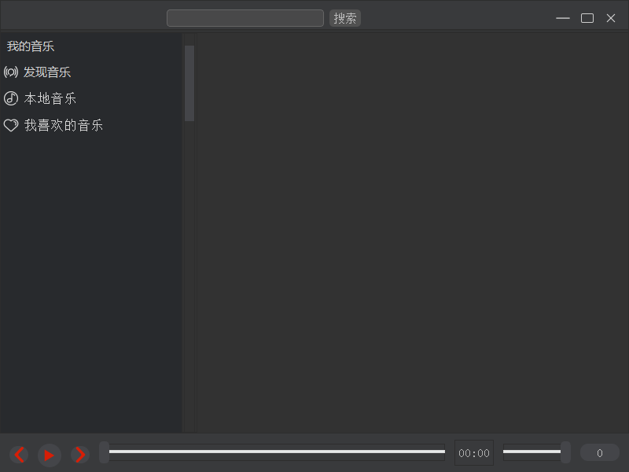

# QtMusicPlayer

网络编程课作业，现在接口已废弃（版权问题），和网络有关的功能已不能使用。

### 开发环境

- Qt 5.12.12
- nvidia driver 472.12(过高的版本与Qt版本不兼容)
- Lav Filters解码器(解决播放时没声音)

### 功能

- 音乐的播放、暂停、切歌等基本操作
- 音乐管理（播放列表）
- 搜索歌曲、歌单、专辑或歌手
- 播放和下载音乐
- 歌词展示

### 实现

- QWidget 搭建的界面，使用CSS美化
- QNetworkManager 发送HTTP请求， QJson(Document | Object | Array) 处理JSON数据
- QXmlStream(Reader | Writer) 将播放列表写入文件中保存

